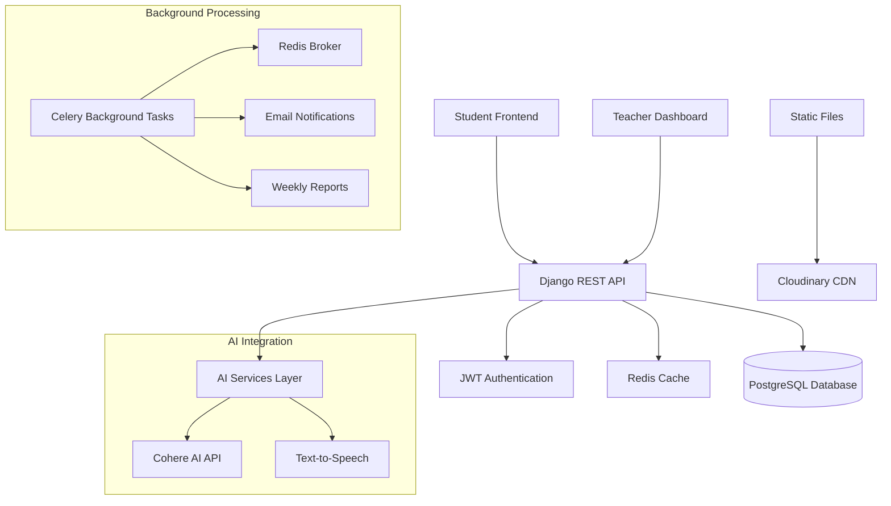
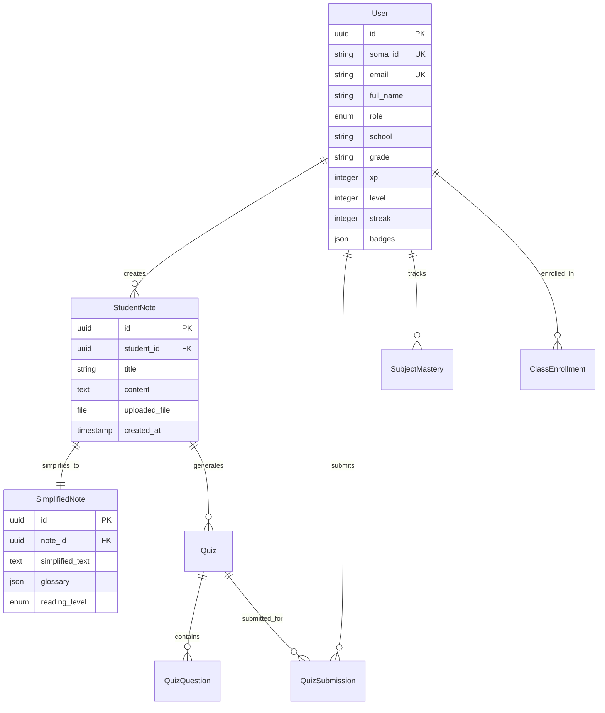

# Soma AI - AI-Powered Learning Platform


An intelligent educational platform designed specifically for African school students , featuring AI-powered content simplification, personalized quizzes, and comprehensive progress tracking.

---

## Overview

Soma AI addresses the critical educational challenges faced by African students by providing AI-powered learning assistance in multiple languages. The platform transforms complex educational content into digestible, grade-appropriate materials while maintaining educational rigor.

**Target Users:** Primary school students (grades P1-P6) and their teachers across 20+ Rwandan schools  
**Problem Solved:** Language barriers, content complexity, lack of personalized learning resources  
**Core Objective:** Democratize quality education through AI-powered content adaptation and progress tracking

---

## Features

### Student Learning Features

- **AI Content Simplification** - Transform complex notes into grade-appropriate language
- **Personalized Quizzes** - AI-generated questions based on simplified content
- **Multi-language Support** - Kinyarwanda, English, French, Swahili
- **Dyslexia Accommodations** - Specialized interface and content adaptation
- **Audio Generation** - Text-to-speech for improved accessibility

### Gamification System

- **XP Points & Leveling** - Earn experience points for completed activities
- **Streak Tracking** - Daily login streaks to encourage consistency
- **Badge System** - Achievement badges for milestones and accomplishments
- **Progress Visualization** - Subject mastery tracking with detailed analytics

### Teacher Dashboard

- **Student Enrollment** - Manage class rosters and student connections
- **Progress Monitoring** - Real-time analytics on student performance
- **Assignment Management** - Create and distribute homework assignments
- **Alert System** - Automated notifications for struggling students
- **Weekly Reports** - Comprehensive student progress summaries

### AI-Powered Features

- **Career Guidance** - 8-question assessment with AI-generated career recommendations
- **Study Planning** - Personalized study schedules and goal setting
- **Content Library** - Curated videos and PDF resources from Rwandan curriculum
- **AI Tutor Chat** - Interactive learning assistance with streaming responses

---

## Screenshots / Demo

🔗 **Live Demo:** `[DEPLOYMENT_URL_PLACEHOLDER]`

📸 **Screenshots:**

```
./screenshots/
├── student-dashboard.png
├── ai-simplifier.png
├── quiz-interface.png
├── teacher-analytics.png
└── career-guidance.png
```

🎥 **Video Demo:** `[VIDEO_DEMO_PLACEHOLDER]`

---

## System Architecture



### Component Breakdown

**Frontend Layer:** React.js application consuming REST APIs  
**API Gateway:** Django REST Framework with JWT authentication  
**AI Services:** Cohere Command-R Plus for content processing and generation  
**Database:** PostgreSQL for structured data with Redis for caching  
**Background Processing:** Celery with Redis broker for async tasks  
**File Storage:** Cloudinary CDN for media and static file delivery  
**Monitoring:** Django admin panel with comprehensive logging

---

## Technology Stack

| Category             | Technology                 | Purpose                             |
| -------------------- | -------------------------- | ----------------------------------- |
| **Backend**          | Django 4.2.30              | Web framework and API               |
| **API**              | Django REST Framework      | RESTful API development             |
| **Database**         | PostgreSQL                 | Primary data storage                |
| **Cache**            | Redis                      | Session management & task queue     |
| **AI/ML**            | Cohere Command-R Plus      | Content simplification & generation |
| **Authentication**   | JWT (SimpleJWT)            | Token-based authentication          |
| **Background Tasks** | Celery                     | Async processing (emails, reports)  |
| **File Storage**     | Cloudinary                 | Media and static file CDN           |
| **Testing**          | pytest + Django Test Suite | Comprehensive testing framework     |
| **Documentation**    | DRF Spectacular            | Auto-generated API documentation    |
| **Deployment**       | Railway + Gunicorn         | Cloud hosting platform              |
| **Monitoring**       | Django Logging             | Application monitoring              |

---

## Project Structure

```
soma_ai/
├── ai_proxy/              # AI chat and streaming endpoints
├── career/                # Career assessment and recommendations
├── community/             # Student community features
├── core/                  # Shared models and utilities
├── dashboard/             # Teacher analytics and management
├── games/                 # Gamification features
├── homework/              # Assignment and homework management
├── library/               # Educational videos and PDF resources
├── notifications/         # Email alerts and messaging
├── planner/               # Study planning and goal setting
├── progress/              # Analytics and progress tracking
├── quizzes/               # AI-generated quiz system
├── services/
│   └── ai/                # AI service abstraction layer
├── simplifier/            # Content simplification engine
├── soma_ai/               # Django project configuration
├── templates/             # Email templates
├── users/                 # Authentication and user management
├── manage.py              # Django management script
├── requirements.txt       # Python dependencies
├── Procfile              # Railway deployment config
└── railway.toml          # Railway build configuration
```

---

## Backend Documentation

### Architecture Pattern

**Modular Django Architecture** with feature-based app organization

### Key Modules

- **Users App:** Custom user model supporting student/teacher roles with unique Soma IDs
- **Simplifier:** AI-powered content processing with Claude integration
- **Quizzes:** Dynamic quiz generation based on simplified content
- **Progress:** Comprehensive analytics with subject mastery tracking
- **Career:** AI-driven career assessment and university recommendations

### Authentication System

- JWT-based authentication with refresh token rotation
- Role-based access control (Student/Teacher)
- Unique Soma ID generation (SOMA-XXXX-XXXX format)
- School-based authentication for enhanced security

### Database Models

- **User:** Extended AbstractUser with gamification fields
- **StudentNote:** Content storage with file upload support
- **SimplifiedNote:** AI-processed content with glossaries
- **Quiz/QuizQuestion:** Dynamic assessment system
- **SubjectMastery:** Granular progress tracking per subject

### AI Integration

- **Cohere Command-R Plus:** Primary AI model for content processing
- **JSON Mode:** Structured responses for quiz generation
- **Streaming Support:** Real-time AI tutor interactions
- **Error Handling:** Comprehensive logging and fallback mechanisms

---

## API Documentation

### Authentication Endpoints

| Method | Endpoint                 | Description                 | Authentication |
| ------ | ------------------------ | --------------------------- | -------------- |
| POST   | `/api/v1/auth/register/` | User registration           | None           |
| POST   | `/api/v1/auth/login/`    | User login                  | None           |
| POST   | `/api/v1/auth/logout/`   | Logout with token blacklist | JWT            |
| GET    | `/api/v1/auth/me/`       | Current user profile        | JWT            |
| PATCH  | `/api/v1/auth/me/`       | Update profile              | JWT            |

### Core Learning Features

| Method | Endpoint                       | Description                | Authentication |
| ------ | ------------------------------ | -------------------------- | -------------- |
| POST   | `/api/v1/notes/`               | Create and simplify note   | JWT            |
| GET    | `/api/v1/notes/`               | List student's notes       | JWT            |
| POST   | `/api/v1/quizzes/`             | Generate quiz from note    | JWT            |
| POST   | `/api/v1/quizzes/{id}/submit/` | Submit quiz answers        | JWT            |
| GET    | `/api/v1/progress/dashboard/`  | Student progress analytics | JWT            |

### Teacher Management

| Method | Endpoint                     | Description               | Authentication |
| ------ | ---------------------------- | ------------------------- | -------------- |
| POST   | `/api/v1/teacher/enroll/`    | Enroll student            | JWT (Teacher)  |
| GET    | `/api/v1/teacher/students/`  | List enrolled students    | JWT (Teacher)  |
| POST   | `/api/v1/assignments/`       | Create class assignment   | JWT (Teacher)  |
| GET    | `/api/v1/teacher/analytics/` | Class performance metrics | JWT (Teacher)  |

### AI Features

| Method | Endpoint                 | Description               | Authentication |
| ------ | ------------------------ | ------------------------- | -------------- |
| POST   | `/api/v1/ai/simplify/`   | AI content simplification | JWT            |
| GET    | `/api/v1/ai/tutor/`      | Streaming AI chat (SSE)   | JWT            |
| POST   | `/api/v1/career/assess/` | Career assessment         | JWT            |

**API Documentation:** Available at `/api/docs/` (Swagger UI) and `/api/redoc/` (ReDoc)

---

## Database Design

### Core Entities



**Database Technology:** PostgreSQL 14+  
**Key Features:** UUID primary keys, JSON fields for structured data, comprehensive indexing  
**Relationships:** One-to-many for user-generated content, many-to-many for teacher-student enrollment

---

## Authentication and Security

### Implementation

- **JWT Authentication** with access/refresh token pattern
- **Role-Based Access Control** enforced at API and database level
- **School Validation** against approved Rwandan institution list
- **Password Security** with Django's built-in hashing (PBKDF2)

### Security Measures

- Environment variable configuration for sensitive data
- CORS protection with whitelist for frontend domains
- CSRF protection for state-changing operations
- Input validation and sanitization on all endpoints
- API rate limiting and request size constraints
- Secure headers and HTTPS enforcement in production

### Permissions System

- Student: Access own content, submit assignments, view progress
- Teacher: Manage enrolled students, create assignments, view analytics
- Superuser: Full administrative access via Django admin

---

## Installation Guide

### Prerequisites

- Python 3.8+
- PostgreSQL 12+
- Redis 6.0+
- Git

### Setup Instructions

1. **Clone Repository**

```bash
git clone https://github.com/username/soma-ai.git
cd soma-ai/soma_ai
```

2. **Create Virtual Environment**

```bash
python -m venv env
source env/bin/activate  # Windows: env\Scripts\activate
```

3. **Install Dependencies**

```bash
pip install -r requirements.txt
```

4. **Configure Environment Variables**

```bash
cp .env.example .env
# Edit .env with your configuration
```

5. **Database Setup**

```bash
python manage.py migrate
python manage.py createsuperuser
```

6. **Start Development Server**

```bash
python manage.py runserver
```

7. **Start Background Workers** (separate terminal)

```bash
celery -A soma_ai worker -l info
celery -A soma_ai beat -l info
```

---

## Environment Variables

| Variable                | Purpose                                | Required |
| ----------------------- | -------------------------------------- | -------- |
| `DJANGO_SECRET_KEY`     | Django security key                    | Yes      |
| `DATABASE_URL`          | PostgreSQL connection string           | Yes      |
| `REDIS_URL`             | Redis connection for cache/celery      | Yes      |
| `COHERE_API_KEY`        | AI model access key                    | Yes      |
| `CLOUDINARY_CLOUD_NAME` | Media storage config                   | Yes      |
| `CLOUDINARY_API_KEY`    | Media storage config                   | Yes      |
| `CLOUDINARY_API_SECRET` | Media storage config                   | Yes      |
| `EMAIL_HOST_USER`       | SMTP email configuration               | No       |
| `EMAIL_HOST_PASSWORD`   | SMTP email configuration               | No       |
| `ALLOWED_HOSTS`         | Production domain whitelist Production |


---

## Testing

### Framework

- **pytest-django** for comprehensive test coverage
- **Factory Boy** for test data generation
- **Coverage.py** for test coverage analysis

### Test Categories

- **Unit Tests:** Model methods, utility functions, serializers
- **Integration Tests:** API endpoint functionality and permissions
- **AI Service Tests:** Mock external API responses and error handling
- **Authentication Tests:** JWT token lifecycle and role permissions

### Running Tests

```bash
# Run all tests
pytest

# Run with coverage report
pytest --cov=. --cov-report=html

# Run specific test module
pytest users/tests.py -v

# Run tests matching pattern
pytest -k "test_user_registration"
```

### Coverage Targets

- Overall coverage: 85%+
- Critical paths (auth, AI, payments): 95%+
- Models and serializers: 90%+

---

## Deployment

### Platform

**Railway** - Modern cloud deployment platform with zero-config PostgreSQL and Redis

### Build Configuration

```toml
# railway.toml
[build]
builder = "nixpacks"

[deploy]
startCommand = "python manage.py migrate && python manage.py collectstatic --noinput && gunicorn soma_ai.wsgi:application --bind 0.0.0.0:$PORT"
restartPolicyType = "ON_FAILURE"
```

### Production Setup

1. **Environment Configuration** - Set production environment variables
2. **Database Migration** - Run `python manage.py migrate`
3. **Static Files** - Collect with `python manage.py collectstatic`
4. **Background Workers** - Deploy Celery worker and beat processes
5. **Monitoring** - Configure logging and error tracking

### Performance Optimization

- **Static file compression** with WhiteNoise
- **Database query optimization** with select_related/prefetch_related
- **Redis caching** for frequently accessed data
- **CDN integration** for media files via Cloudinary

---

## AI Integration

### Primary AI Service

**Cohere Command-R Plus** - Production-grade language model optimized for educational content

### AI Features Implementation

#### Content Simplification

- **Input:** Raw student notes (text/PDF)
- **Processing:** AI analyzes complexity and grade level
- **Output:** Simplified text with glossary of key terms
- **Languages:** English, Kinyarwanda, French, Swahili

#### Quiz Generation

- **Source:** Simplified notes content
- **Generation:** Multiple-choice questions with explanations
- **Difficulty:** Adaptive based on student grade level
- **Scoring:** Server-side validation prevents manipulation

#### Career Assessment

- **Process:** 8-question personality/interest assessment
- **AI Analysis:** Matches responses to career profiles
- **Output:** 3 ranked career recommendations with local university options
- **Focus:** African job market and educational pathways

#### Streaming AI Tutor

- **Technology:** Server-Sent Events (SSE) for real-time responses
- **Context:** Maintains conversation history
- **Personalization:** Adapts to student learning style and grade level

---

## Development Practices

### Code Organization

- **Feature-based Django apps** for clear separation of concerns
- **Service layer pattern** for AI integration and external APIs
- **Consistent naming conventions** following Django best practices
- **Comprehensive docstrings** for all models, views, and utilities

### Git Workflow

- **Feature branch development** with pull request reviews
- **Semantic commit messages** for clear change tracking
- **Automated testing** on all pull requests
- **Protected main branch** requiring review approval

### Code Quality

- **Django best practices** for security, performance, and maintainability
- **DRF serializers** for data validation and API consistency
- **Custom permissions** for granular access control
- **Error handling** with comprehensive logging and user feedback

### Testing Strategy

- **Test-driven development** for critical features
- **Mock external services** to ensure reliable test execution
- **Database isolation** with pytest fixtures
- **CI/CD integration** for automated test execution

---

## Challenges and Solutions

### Challenge: Multi-language Content Processing

**Problem:** Ensuring AI-generated content maintains educational quality across different languages  
**Solution:** Implemented language-specific prompting with cultural context awareness and validation workflows

### Challenge: Real-time AI Responses

**Problem:** Providing responsive AI tutoring without blocking the main application  
**Solution:** Implemented Server-Sent Events (SSE) streaming with Cohere's streaming API for real-time token delivery

### Challenge: Scalable Progress Tracking

**Problem:** Calculating complex analytics for thousands of students without performance impact  
**Solution:** Background task processing with Celery and Redis, pre-computed weekly snapshots, and efficient database queries

### Challenge: Dyslexia Accessibility

**Problem:** Creating genuinely accessible content for students with learning differences  
**Solution:** Implemented specialized reading levels, audio generation, and dyslexia-friendly UI adaptations

---

## Future Improvements

### Technical Enhancements

- **Offline Capability** - Progressive Web App (PWA) features for areas with limited internet
- **Advanced Analytics** - Machine learning models for predictive student outcomes
- **Multi-tenant Architecture** - Support for multiple school districts with data isolation
- **Mobile Applications** - Native iOS/Android apps for improved mobile experience

### Educational Features

- **Peer Learning** - Student collaboration features and study groups
- **Parent Dashboard** - Progress reporting and communication tools for parents
- **Adaptive Learning** - Personalized learning paths based on individual progress patterns
- **Assessment Analytics** - Advanced quiz analytics with learning gap identification

### Infrastructure Scaling

- **Microservices Architecture** - Break down monolithic structure for better scalability
- **Container Orchestration** - Kubernetes deployment for auto-scaling capabilities
- **CDN Integration** - Global content delivery for improved performance
- **Multi-region Deployment** - Geographic redundancy and reduced latency

---

## Why This Project Matters

This platform demonstrates advanced **full-stack development skills** combining modern web technologies with cutting-edge AI integration. The project showcases **systems thinking** by addressing real-world educational challenges through technology, while implementing **production-grade practices** including comprehensive testing, security measures, and scalable architecture.

The **technical complexity** spans multiple domains: RESTful API development, AI/ML integration, real-time systems, background processing, and cloud deployment. The **social impact** focus demonstrates ability to build meaningful technology solutions that address genuine societal needs in emerging markets.

**Engineering Value:**

- Complex system design with multiple interconnected services
- AI integration with streaming capabilities and error handling
- Comprehensive authentication and authorization implementation
- Real-world deployment experience with modern cloud platforms
- Production-ready code quality with testing and documentation

---

## Author

**Developer:** Thierry Duhirimana

---

## License

This project is licensed under the MIT License - see the [LICENSE](LICENSE) file for details.

---

_Empowering African education through AI innovation_ 🌍✨
